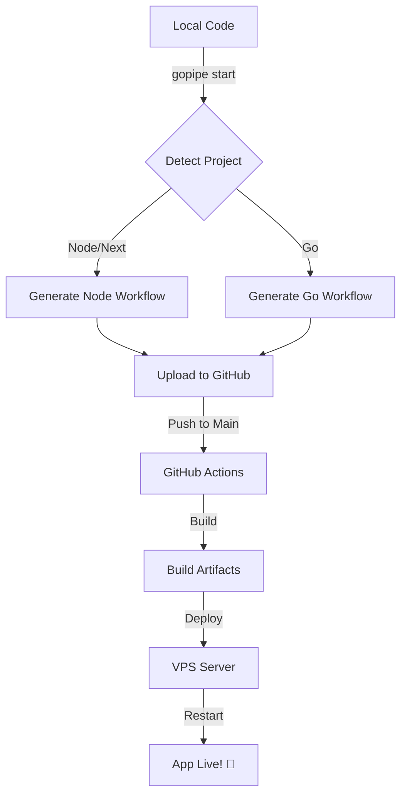

# 🚀 GoPipe

**GoPipe** adalah CLI tool sakti buat generate workflow CI/CD GitHub Actions secara otomatis. Gak perlu pusing lagi mikirin YAML, biar GoPipe yang beresin!

---

## ✨ Features

- 🔍 **Auto Project Detection**: Detect Node.js, Next.js, dan Go secara otomatis.
- 🔌 **Smart Port Discovery**: Nyari port aplikasi lu dari `.env` atau source code.
- 📂 **GitHub Integration**: Bikin repo baru atau hubungin ke repo yang udah ada.
- 🔐 **Secret Automation**: Upload SSH secrets ke GitHub secara otomatis pake `gh` CLI.
- 🚀 **VPS Deployment**: Setup deployment pake SCP/Rsync dan auto-restart service (PM2/Systemd).

---

## 🏗️ Workflow Diagram



---

## 🛠️ Installation

```bash
# Clone repository
git clone https://github.com/RayhanDitaAdam/test-gopipe.git

# Masuk ke folder
cd test-gopipe

# Install (pake script sakti)
bash install.sh
```

---

## 🚀 Usage

Cukup jalankan perintah ini di root project lu:

```bash
gopipe start
```

Ikuti petunjuk di layar, duduk manis, dan boom! CI/CD lu udah siap. 🔥

---

## 📁 Project Structure

```text
.
├── cmd/
│   └── gopipe/
│       └── main.go       # Entry point
├── internal/
│   ├── commands/         # CLI logic & routing
│   ├── config/           # Config management
│   ├── detector/         # Project & Port detection
│   ├── github/           # GitHub CLI integration
│   └── workflow/         # YAML Generator
├── PRD.md                # Product Requirements
├── FUNDAMENTAL.md        # Technical fundamentals
└── README.md             # This file
```

---

## 📖 Documentation

- [PRD.md](./docs/PRD.md) - Visi dan fitur produk.
- [FUNDAMENTAL.md](./docs/FUNDAMENTAL.md) - Cara kerja dan arsitektur teknis.

---

